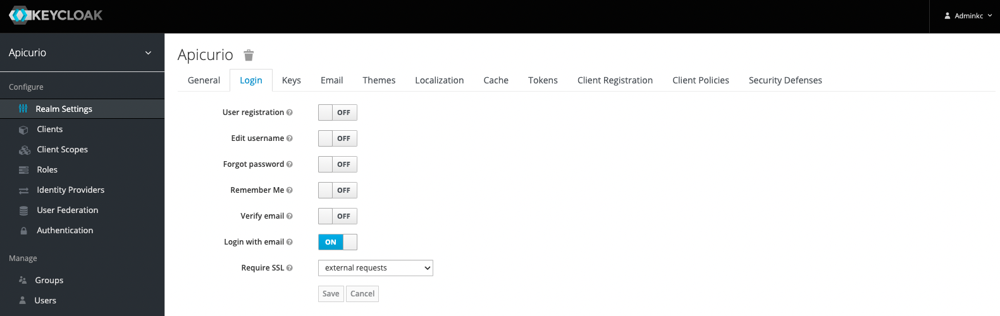
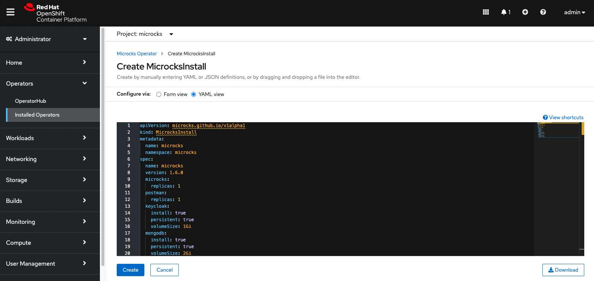
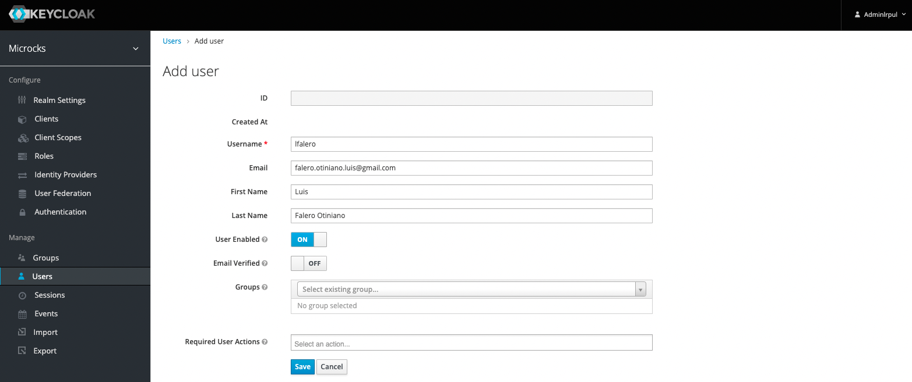
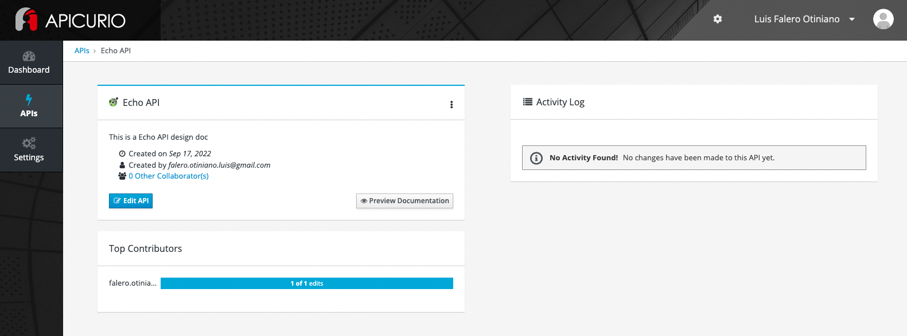

# APICURIO

Se basa en la referencia del siguiente enlace:

https://github.com/Apicurio/apicurio-studio/tree/master/distro/openshift

## 1. Instalación de Apicurio

Primero deberá de iniciar sesión al OpenShift

```shell
source ocp4.config
```

```shell
oc login -u ${OCP4_USER} -p ${OCP4_PASSWORD} ${OCP4_MASTER_API}
```

Crear proyecto con el nombre de **apicurio**

```shell
oc new-project apicurio
```

### 1.1. Ejecutar Template para Apicurio Standalone (Opción 01)

Crear el template de **Apicurio Postgres**

```shell
oc -n apicurio apply -f ./apicurio/apicurio-standalone-template.yml
```

Ejecutar el template de la creación de **Apicurio Studio Standalone**

```shell
oc -n apicurio process apicurio-studio-standalone \
    -p UI_ROUTE=${UI_ROUTE} \
    -p API_ROUTE=${API_ROUTE} \
    -p WS_ROUTE=${WS_ROUTE} \
    -p AUTH_ROUTE=${AUTH_ROUTE} \
    -p GENERATED_DB_USER=${DB_USER} \
    -p DB_NAME=${DB_NAME} \
    -p KC_REALM=${KC_REALM} \
    -p GENERATED_KC_USER=${KC_USER} \
    | oc apply -f -
```

### 1.2. Ejecutar Template para Apicurio Postgres (Opción 02)

Crear el template de **Apicurio Postgres**

```shell
oc -n apicurio apply -f ./apicurio/apicurio-postgres-template.yml
```

Ejecutar el template de la creación de **Apicurio Postgres**

```shell
oc -n apicurio process apicurio-postgres \
    -p DB_NAME=${DB_NAME} \
    -p GENERATED_DB_USER=${DB_USER} \
    | oc apply -f -
```

Usar el comando **oc get secret** para recuperar la contraseña de la Base de Datos.

La contraseña de la Base de Datos se almacenan en el secreto **postgresql**. Al ejecutar el siguiente comando, se recupera la el valor de **database-password**. Luego, debido a que el secreto está codificado en Base64, se decodifica.

```shell
export DB_PASS=$(oc -n apicurio get secret postgresql \
    --template='{{index .data "database-password"}}' | base64 -d; echo)
```

Validar nueva variable de entorno

```shell
echo ${DB_PASS}
```

### 1.3. Ejecutar Template para Apicurio Auth (Opción 02)

Crear el template de **Apicurio Auth**

```shell
oc -n apicurio apply -f ./apicurio/apicurio-auth-template.yml
```

Ejecutar el template de la creación de **Apicurio Auth**

```shell
oc -n apicurio process apicurio-auth \
    -p KC_REALM=${KC_REALM} \
    -p GENERATED_KC_USER=${KC_USER} \
    -p AUTH_ROUTE=${AUTH_ROUTE} \
    -p UI_ROUTE=${UI_ROUTE} \
    -p DB_USER=${DB_USER} \
    -p DB_PASS=${DB_PASS} \
    -p DB_NAME=${DB_NAME} \
    -p DB_VENDOR=${DB_VENDOR} \
    | oc apply -f -
```

Usar el comando **oc get secret** para recuperar la contraseña de la Base de Datos.

La contraseña de la Base de Datos se almacenan en el secreto **apicurio-studio-auth**. Al ejecutar el siguiente comando, se recupera la el valor de **keycloak-password**. Luego, debido a que el secreto está codificado en Base64, se decodifica.

```shell
export KC_PASS=$(oc -n apicurio get secret apicurio-studio-auth \
    --template='{{index .data "keycloak-password"}}' | base64 -d; echo)
```

Validar nueva variable de entorno

```shell
echo ${KC_PASS}
```

### 1.4. Ejecutar Template para Apicurio Studio (Opción 02)

Crear el template de **Apicurio Studio**

```shell
oc -n apicurio apply -f ./apicurio/apicurio-template.yml
```

Ejecutar el template de la creación de **Apicurio Studio**

```shell
oc -n apicurio process apicurio-studio \
    -p UI_ROUTE=${UI_ROUTE} \
    -p API_ROUTE=${API_ROUTE} \
    -p WS_ROUTE=${WS_ROUTE} \
    -p AUTH_ROUTE=${AUTH_ROUTE} \
    -p DB_USER=${DB_USER} \
    -p DB_PASS=${DB_PASS} \
    -p DB_NAME=${DB_NAME} \
    -p KC_REALM=${KC_REALM} \
    -p KC_USER=${KC_USER} \
    -p KC_PASS=${KC_PASS} \
    | oc apply -f -
```

### 1.4. Acceso al portal de Apicurio

Para poder acceder al portal del **Apicurio Keycloak Admin Console**, debemos de obtener el usuario y clave de los secretos.

En el panel izquierdo, hacer click en **Workloads → Secrets**. Luego hacer click en el secreto **apicurio-studio-auth**.


Almacenar los valores **keycloak-user** y **keycloak-password** de para inicar sesión **Apicurio Keycloak Admin Console**.


En el panel izquierdo, hacer click en **Networking → Routes**. Luego hacer click en la url del route **apicurio-studio-auth**.


Acceder con las credenciales almacenadas anteriormente.


En el panel izquierdo, hacer click en **Realm Settings**. Luego hacer click en la pestaña **Login** y mantener la siguiente configuración:

- **User registration:** OFF
- **Edit username:** OFF
- **Forgot password:** OFF
- **Remember Me:** OFF
- **Verify email:** OFF
- **Login with email:** ON
- **Require SSL:** external request



En el panel izquierdo, hacer click en **User**. Luego hacer click en el botón **Add user** para poder acceder a la **Apicurio Console**.


Completar el formulario con los siguientes datos:

- **Email:** falero.otiniano.luis@gmail.com
- **First Name:** Luis
- **Last Name:** Falero Otiniano
- **User Enabled:** ON


Hacer click en la pestaña **Credentials** y completar con el siguiente formulario:

- **Password:** redhat
- **Password Confirmation:** redhat
- **Temporary:** OFF


Hacer click en el botón **Set password**


Hacer click en la pestaña **Role Mappings**, seleccionar en **Client Roles** la opción **realm-management** y asignar los siguientes roles: 

- **manage-clients** 
- **manage-users**


En el panel izquierdo, hacer click en **Networking → Routes**. Luego hacer click en la url del route **apicurio-studio-ui**.


Acceder con las credenciales almacenadas anteriormente.

- **Email:** falero.otiniano.luis@gmail.com
- **Password:** redhat


Muestra la primera pantalla de **Apicurio Console**.


## 2. Instalación de Microcks

Crear proyecto con el nombre de **microcks**

```shell
oc new-project microcks
```

En el panel Administrador, hacer click en **Operators → OperatorHub**


Hacer click en **Continue**.


Hacer click en **Install**.


Completar el formulario con los siguientes parámetros y luego hacer click en **Install**.

- **Update channel:** stable
- **Installed Namespace:** microcks
- **Update approval:** Manual


Hacher click en **View Operator** para acceder a la página de detalles del operador.


Para implementar un recurso personalizado en **Microcks**, ir a la sección **MicrocksInstall** y hacer click en **Create MicrocksInstall**.


Actualizar el YAML de acuerdo con el siguiente fragmento.

```yaml
apiVersion: microcks.github.io/v1alpha1
kind: MicrocksInstall
metadata:
  name: microcks
  namespace: microcks
spec:
  name: microcks
  version: 1.6.0
  microcks:
    replicas: 1
  postman:
    replicas: 1
  keycloak:
    install: true
    persistent: true
    volumeSize: 1Gi
  mongodb:
    install: true
    persistent: true
    volumeSize: 2Gi
```



Validar que todos los pods estén en estado **Running**


Para poder acceder al portal del **Microcks Keycloak Admin Console**, debemos de obtener el usuario y clave de los secretos.

En el panel izquierdo, hacer click en **Workloads → Secrets**. Luego hacer click en el secreto **microcks-keycloak-admin**.


Almacenar los valores **username** y **password** de para inicar sesión **Microcks Keycloak Admin Console**.


En el panel izquierdo, hacer click en **Networking → Routes**. Luego hacer click en la url del route **microcks-keycloak**.


Hacher click en **Administration Console**


Acceder con las credenciales almacenadas anteriormente.


En el panel izquierdo, hacer click en **User**. Luego hacer click en el botón **Add user** para poder acceder a la **Microcks Console**.


Completar el formulario con los siguientes datos:

- **Username:** lfalero
- **Email:** falero.otiniano.luis@gmail.com
- **First Name:** Luis
- **Last Name:** Falero Otiniano
- **User Enabled:** ON



Hacer click en la pestaña **Credentials** y completar con el siguiente formulario:

- **Password:** redhat
- **Password Confirmation:** redhat
- **Temporary:** OFF


Hacer click en el botón **Set password**


Hacer click en la pestaña **Role Mappings**, seleccionar en **Client Roles** la opción **realm-management** y asignar los siguientes roles: 

- **manage-clients** 
- **manage-users**


Para tener acceso administrador, hacer click en la pestaña **Role Mappings**, seleccionar en **Client Roles** la opción **microcks-apps** y asignar los siguientes roles: 

- **admin** 
- **manager**


En el panel izquierdo, hacer click en **Networking → Routes**. Luego hacer click en la url del route **microcks**.


Acceder con las credenciales almacenadas anteriormente.

- **Email:** lfalero
- **Password:** redhat


Muestra la primera pantalla de **Microcks Console**.


## 3. Integración de Apicurio con Microcks

Hacer click en el botón **Create new API**


Completar el formulario con los siguientes datos:

- **Name:**: Echo API
- **Description:** This is a Echo API design doc
- **Type:** Open API 3.0.2
- **Template:** Pet Store Example


Para ver el detalle de la documentación, hacer click en **Preview Documentation**



Detalle del OpenAPI


Acceder al **Microcks Keycloak**, luego hacer click en **Clients** y seleccionar **microcks-serviceaccount**


Hacer click en la pestaña **Credentials** y almacenar el nombre **microcks-serviceaccount** y con el **secret**


Para poder integrar Apicurio con Microcks, debemos de agregregar algunas variables de entorno en dos **DeploymentConfigs**

## 3.1. Configuración de Apicurio Studio Backend

En el panel izquierdo, hacer click en **Workloads → DeploymentConfigs**. Luego hacer click en el configmap **apicurio-studio-api**.


Hacer click en la pestaña **Environment**


Agregar los siguientes valores:

- **APICURIO_MICROCKS_API_URL:** https://microcks-microcks.apps.cluster-xdz9q.xdz9q.sandbox1349.opentlc.com/api
- **APICURIO_MICROCKS_CLIENT_ID:** microcks-serviceaccount
- **APICURIO_MICROCKS_CLIENT_SECRET:** ab54d329-e435-41ae-a900-ec6b3fe15c54


## 3.2. Configuración de Apicurio Studio Frontend

En el panel izquierdo, hacer click en **Workloads → DeploymentConfigs**. Luego hacer click en el configmap **apicurio-studio-ui**.


Hacer click en la pestaña **Environment** y agregar el siguientes valor:

- **APICURIO_UI_FEATURE_MICROCKS:** true


Se habilitó la sección de **API Mocking**. Hacer click en **Mock with Microcks**


Hacer click en el botón **Mock API**


Se realizó la migración satisfactoriamente. Hacer click en el botón **OK**


Muestra el detalle de la integración. Hacer click en el botón **View in Microcks**


Muestra el nuevo registro de la API en **Microcks**


Selecionar una API para validar


Ejecutar el Postman con la ruta copiada anteriormente

